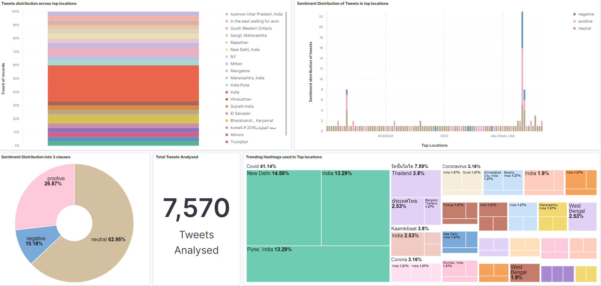
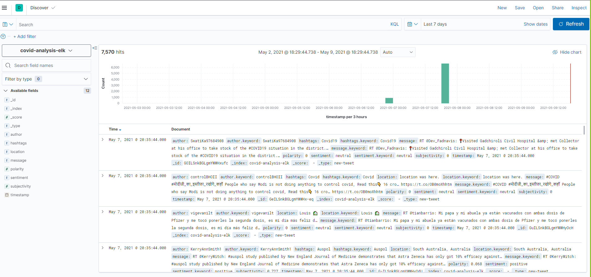

Install Python Packages  
pip install tweepy  
pip install -U textblob  
python -m textblob.download_corpora  
pip install elasticsearch  

STEPS: 
Run Elasticsearch before running main.py  
bin\elasticsearch.bat (in the elasticsearch folder)  
 
python main.py keywords 
(keyboard interrupt to stop) 

then run kibana 
bin\kibana.bat (in the kibana folder) 
Create index-pattern at http://localhost:5601

Datasets: 
[CDC Data](https://data.humdata.org/dataset/coronavirus-covid-19-cases-and-deaths)
[Twitter Historical Batch Data](https://www.kaggle.com/gpreda/covid19-tweets)

